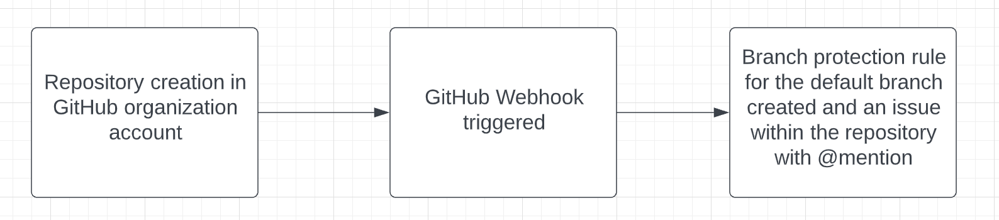

# Webhook

## What does this project do?

- A webhook that listens for GitHub organization repository events to know when a repository has been created.
- When the repository is created, the protection of the default branch is created automatically.
- Notifies the creator with a @mention in an issue within the repository that outlines the protections that were added.

## Flow Diagram

## Installations needed

- Install node
- Install yarn
- Refer 'versions.txt' for versions used during this project development

## Before Running the Project

- Set githubToken as an environment variable with a value that corresponds to a GitHub Token (ex- export githubToken=xxxxxxxxxx) - [GitHub Token Creation](https://docs.github.com/en/authentication/keeping-your-account-and-data-secure/creating-a-personal-access-token)
- Set githubUserName as an environment variable with a value that corresponds to the username you want to mention in the issue created (ex - export githubUserName=xxxxxxx)

## Useful commands

- Run 'npm run verify:prettier' to verify prettify on the project
- Run 'npm run fix:prettier' to fix prettify on the project

## Steps to get the Webhook project Setup

### How to run this project?

- Run 'npm install' from the root of the module to install all the dependent packages
- Run 'npm run dev' to start the project on port 3030

### Assign a Public IP for the application

- To integrate this project to GitHub webhook, assign a public IP and open incoming port 3030 on the server this project is running

### Setup Webhook integration on Organization level in Github for any actions taken on repository level

- [Documentation by GITHUB](https://docs.github.com/en/developers/webhooks-and-events/webhooks/creating-webhooks)
- The payload url should be the Public IP on which the app is hosted (ex- http://<ip_address>:3030/)
- Select Content type as application/json
- For event types select repositories and save the webhook

## Working

- Create a repository under the organization
- Branch protection rule for the default branch should be created along with an issue

## Git CI pipeline

- A GitHub CI pipeline runs to verify the code prettier on any commits to the main branch

## Related Documentations

- [GitHub Webhooks](https://docs.github.com/en/developers/webhooks-and-events/webhooks/about-webhooks)
- [GitHib API](https://docs.github.com/en/rest)
- [GitHub CI](https://docs.github.com/en/actions)
- [Express](https://expressjs.com/)
- [NodeJS](https://nodejs.org/en/)
- [yarn](https://yarnpkg.com/)
- [TypeScript](https://www.typescriptlang.org/)
